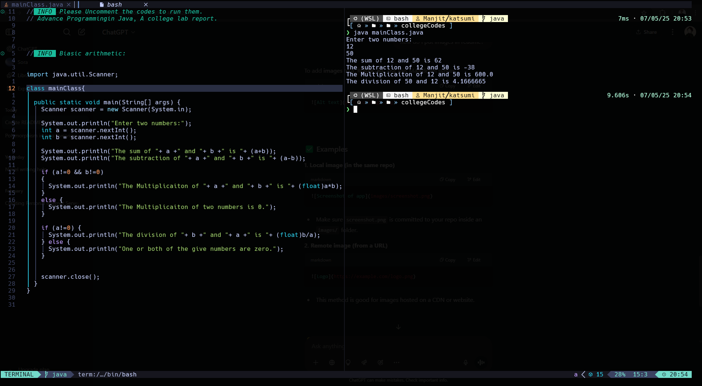
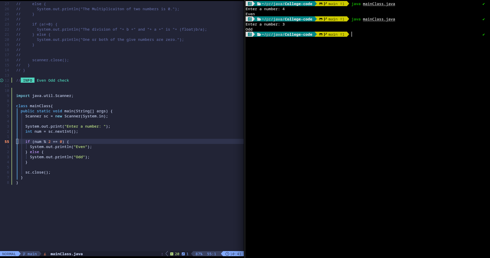
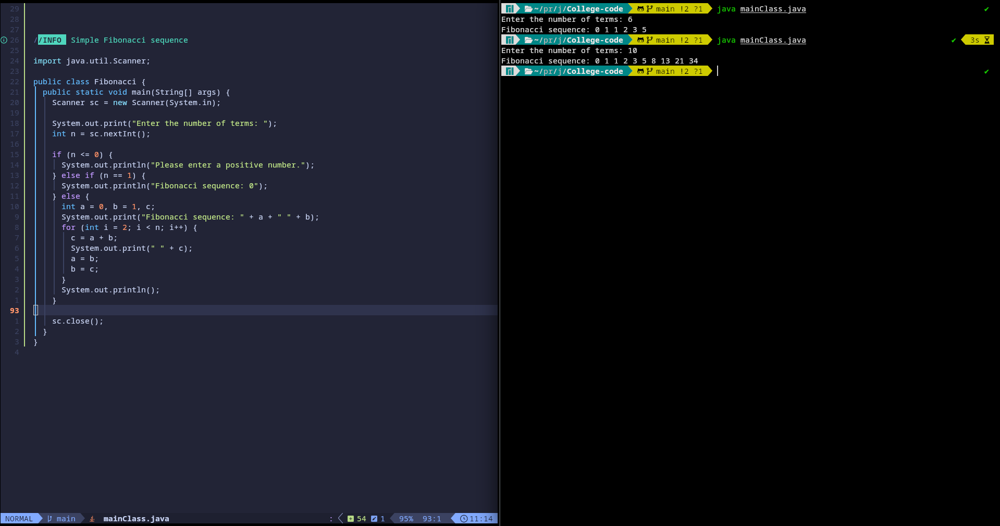
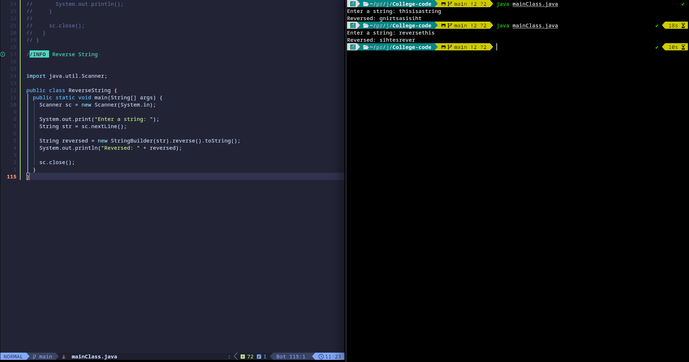
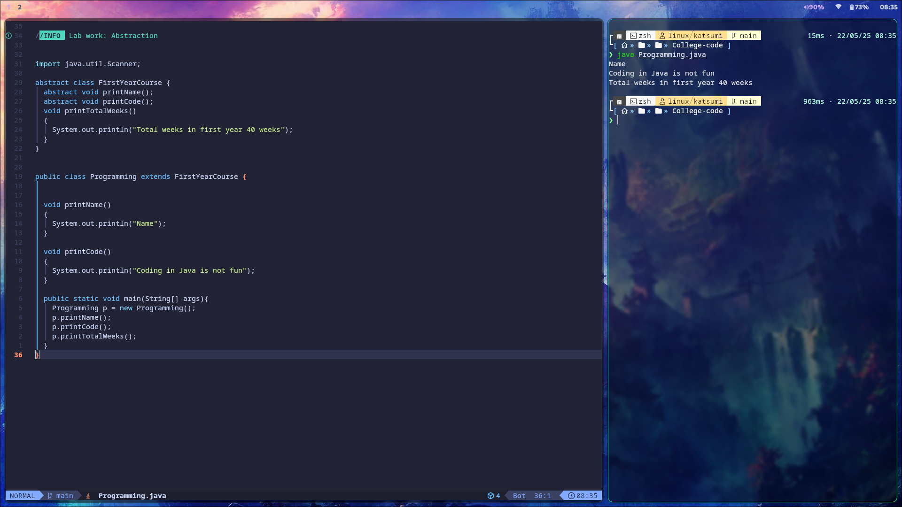
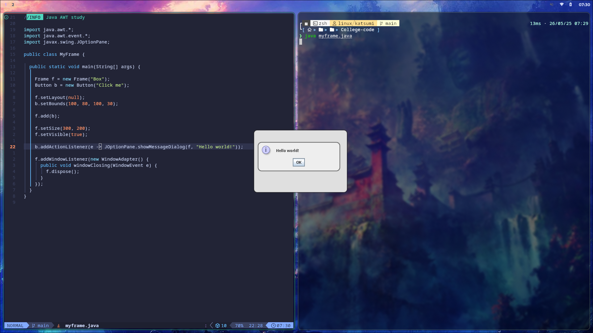

# Java codes

  This repo is the collection of all java codes starting from basics and moving up in difficulty as the course progresses.
  Basic outputs for each new code will be put here as an image along with the codes beside it. 

### Basic Arithmetic operations

  

### Basic Even Odd check

  

### Simple Fibonacci sequence

  

### Reverse String

  

### Lab work: Abstraction

  

### Java AWT Frame

  
  

